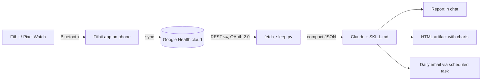

# sleep-report — a Claude Code skill for Google Health sleep data

**English** · [Українська](README.uk.md)

A [Claude Code skill](https://docs.claude.com/en/docs/claude-code/skills) that reads your sleep data from the **Google Health API** (the successor of the Fitbit Web API) and turns it into a sleep analysis: duration, stages, efficiency, schedule regularity, resting heart rate, HRV, SpO₂, trends and concrete recommendations.

Works with anything that syncs into Google Health — Fitbit trackers (Air, Charge, Inspire, Sense, Versa), Pixel Watch, and data from other apps that land there via Health Connect (e.g. Apple Health).

```
> /sleep-report last night
> /sleep-report 30
> /sleep-report artifact      # also publishes an HTML page with charts
> how did I sleep this week?
```

- Only Python 3.9+ standard library — no `pip install`.
- Read-only OAuth scopes. Credentials never leave your machine and are **not** part of this repo.

---

## How it works



The skill has two layers:

1. **Python scripts** (deterministic) — authorize, call the API, normalize the data into a compact JSON.
2. **`SKILL.md`** (instructions for Claude) — when to use the skill, how to check data quality, which metrics to compute, what reference ranges to use and how to structure the report.

Claude never calculates numbers "by eye": the instructions require computing stats with a short Python snippet over the JSON, and forbid inventing values if the data is missing.

### 1. Authorization — `scripts/auth.py`

- Uses **your own** Google Cloud OAuth client (type *Desktop app*), stored in `~/.config/google-health/client_secret.json`.
- Standard OAuth 2.0 **authorization code flow with PKCE** and a **loopback redirect**: the script starts a tiny HTTP server on `127.0.0.1:<random port>`, prints the Google consent URL, and waits (up to 5 min) for Google to redirect back with the code. The `state` parameter is checked to prevent CSRF.
- Requests `access_type=offline` to get a refresh token, exchanges the code at `https://oauth2.googleapis.com/token` and saves the result to `~/.config/google-health/token.json`.
- Warns if you didn't tick all scope checkboxes on the consent screen.

Scopes (all read-only):

| Scope | Used for |
|---|---|
| `googlehealth.sleep.readonly` | sleep sessions and stages |
| `googlehealth.health_metrics_and_measurements.readonly` | resting HR, HRV, SpO₂, breathing rate, temperature |
| `googlehealth.activity_and_fitness.readonly` | workouts (late exercise vs sleep quality) |

### 2. Token handling — `scripts/gh_common.py`

- Before each run it checks the access token's expiry (with a 2-minute margin) and refreshes it using the refresh token when needed.
- Exit code **4** means the refresh token is gone or revoked — the skill tells Claude to re-run `auth.py`. While your Google app is in *Testing* mode, refresh tokens live **7 days**, so this happens weekly.

### 3. Fetching — `scripts/fetch_sleep.py`

Calls `GET https://health.googleapis.com/v4/users/me/dataTypes/{type}/dataPoints` with pagination (`pageToken`) for:

| Data type | Filter (AIP-160) |
|---|---|
| `sleep` | `sleep.interval.end_time >= "<RFC3339>"` (page size ≤ 25) |
| `exercise` | `exercise.interval.civil_start_time >= "YYYY-MM-DD"` |
| `daily-resting-heart-rate` | `daily_resting_heart_rate.date >= "YYYY-MM-DD"` |
| `daily-heart-rate-variability` | `daily_heart_rate_variability.date >= …` |
| `daily-oxygen-saturation` | `daily_oxygen_saturation.date >= …` |
| `daily-respiratory-rate` | `daily_respiratory_rate.date >= …` |
| `daily-sleep-temperature-derivations` | `daily_sleep_temperature_derivations.date >= …` |

> Note: the data type in the URL is kebab-case, but in filters it must be **snake_case** — the camelCase form from the docs returns `400 INVALID_DATA_POINT_FILTER`.

An error on one data type doesn't stop the others — it is reported in `errors`.

### 4. Normalization

For every sleep session the script:

- converts UTC timestamps to local time using the session's own `startUtcOffset`/`endUtcOffset` (so travel/time-zone changes are handled);
- sums stage intervals (`DEEP`, `LIGHT`, `REM`, `AWAKE`) into minutes and % of time asleep, computes efficiency (asleep / in bed), counts wake bouts and short awakenings, and keeps the API's own `summary`;
- attributes the night to the **wake-up date** and marks the main sleep per day (API `metadata.mainSleep` first, else the longest session) — everything else is a nap;
- **de-duplicates across sources**: Google Health can hold the same night from several sources (Fitbit, Apple Health via Health Connect, Google Fit). Sessions overlapping by > 50% are merged, keeping Fitbit first, then Health Connect, then others. Daily metrics are likewise one value per day per metric, Fitbit preferred. Every record keeps a `source` label.

Full raw API responses are saved to a temp file (`raw_dump`) so Claude can inspect them if the schema changes.

Example output (illustrative values):

```json
{
  "period": {"days": 14, "since": "2026-09-04", "until": "2026-09-18"},
  "nights": [{
    "source": "FITBIT:Google Fitbit Air", "wake_date": "2026-09-18", "is_main": true,
    "bedtime": "2026-09-17 23:40", "waketime": "2026-09-18 07:10",
    "in_bed_min": 450, "asleep_min": 425, "efficiency_pct": 94,
    "stages_min": {"AWAKE": 25, "DEEP": 70, "LIGHT": 250, "REM": 105},
    "stages_pct_of_asleep": {"DEEP": 16.5, "LIGHT": 58.8, "REM": 24.7},
    "short_awakenings": 12
  }],
  "daily_metrics": {"2026-09-18": {
    "daily-resting-heart-rate": {"source": "FITBIT:Google Fitbit Air", "dailyRestingHeartRate.beatsPerMinute": 62}
  }},
  "errors": {}, "duplicate_sleep_sessions_dropped": 0
}
```

### 5. Analysis and report (Claude)

`SKILL.md` tells Claude to:

- validate the data first (errors, empty sync, schema drift) and never make numbers up;
- compute duration stats, bedtime/wake-time mean and SD (with midnight wrap-around), weekday vs weekend "social jet lag", stage percentages against typical adult ranges, efficiency, and recovery trends (RHR, HRV, SpO₂, breathing, temperature);
- **never compare absolute values across devices** — trends are computed within one source;
- look for correlations (late bedtime vs deep sleep, late workouts vs efficiency) only with ≥ 10 nights, and state the small-sample caveat;
- write a report: summary → per-night table → good/bad with numbers → 3–5 concrete recommendations tied to the findings → a medical disclaimer.

With `artifact`, Claude also builds an interactive HTML page: last-night hypnogram, stacked stage bars with a 7-hour line, bedtime→wake bars per night, and RHR / HRV / SpO₂ small multiples.

---

## Installation

1. Copy the `sleep-report` folder into your personal skills directory:
   ```bash
   git clone https://github.com/decadance/google-health-sleep-skill.git
   cp -r google-health-sleep-skill/sleep-report ~/.claude/skills/
   ```
   (Windows: `%USERPROFILE%\.claude\skills\sleep-report`.)
2. Do the one-time Google Cloud setup below.
3. In Claude Code, run `/sleep-report` — Claude will run the authorization and your first report.

### One-time Google Cloud setup (~10 min)

1. Open [Google Cloud Console](https://console.cloud.google.com/) → create a project.
2. **APIs & Services → Library** → **Google Health API** → *Enable*.
3. **Google Auth Platform → Branding**: app name, support email, audience **External**, contact email → accept the User Data Policy → *Create*.
4. **Data Access → Add or remove scopes** → paste the three scopes from the table above → *Update* → *Save*. They appear under *restricted scopes* — that's expected.
5. **Audience → Test users** → add the Google account your tracker is linked to.
6. **Clients → Create client** → *Desktop app* → *Create* → **Download JSON** (the secret is shown only once).
7. Save the file as `~/.config/google-health/client_secret.json`.

On first run, the consent screen will say *"Google hasn't verified this app"* — it's your own app, click *Continue*, then **tick all checkboxes**.

### Manual usage (without Claude)

```bash
python sleep-report/scripts/auth.py            # opens the browser; add --no-browser to just print the URL
python sleep-report/scripts/fetch_sleep.py --days 30 > sleep.json
```

---

## Daily morning report (optional)

In the Claude desktop app you can create a **scheduled task** (e.g. every day at 09:00) with a prompt like:

> Use the `sleep-report` skill: fetch 14 days, analyze last night against the 14-day average (compare HR/HRV only within the same source), and send me a short email via the Gmail connector to *&lt;your address&gt;* with subject `Sleep <date>: <duration>, <verdict>`. Fill `sleep-report/email_template.html` and pass it as `htmlBody`. If fetch exits with code 4, only email me that Google Health access needs renewing. If last night hasn't synced yet, say so.

Pick a time when your phone has already synced the night. Scheduled tasks run while the app is open.

The email template [`sleep-report/email_template.html`](sleep-report/email_template.html) is a single phone-friendly column with inline styles only (Gmail strips `<style>`). Pass the filled HTML in **`htmlBody`**, not `body` — otherwise the email shows raw tags.

---

## Security & privacy

- **No credentials in this repo.** `client_secret.json` and `token.json` live in `~/.config/google-health/` and are listed in `.gitignore` just in case.
- All scopes are **read-only**. The scripts only talk to `accounts.google.com`, `oauth2.googleapis.com` and `health.googleapis.com`.
- Your health data is sent to Claude as part of the conversation when you run the skill — keep that in mind.
- To revoke access: [myaccount.google.com/permissions](https://myaccount.google.com/permissions) → your app → *Remove access*, and delete `~/.config/google-health/token.json`.

## Limitations

- Refresh tokens expire every 7 days while the Google app is in *Testing* (restricted scopes require Google verification for production).
- Wrist-based sleep stages are estimates, not polysomnography.
- The Google Health API is new (2026); field names or filter syntax may change — `raw_dump` and the troubleshooting section in `SKILL.md` exist for that.
- Not a medical device, not medical advice.

## Troubleshooting

| Symptom | Fix |
|---|---|
| exit code 2 | `client_secret.json` missing — see setup step 7 |
| exit code 4 | token expired/revoked — run `auth.py` again |
| `403 SERVICE_DISABLED` | enable *Google Health API* in the Cloud project |
| `403 PERMISSION_DENIED` | re-authorize and tick every checkbox |
| `400 INVALID_DATA_POINT_FILTER` | filter syntax changed — see the table above and `raw_dump` |
| `counts.sleep == 0` | open the Fitbit app on your phone to sync |
| `access_denied` on consent | add your account under *Audience → Test users* |

## License

MIT
