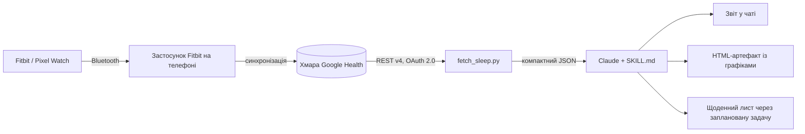

# sleep-report — скіл Claude Code для аналізу сну з Google Health

[English](README.md) · **Українська**

[Скіл для Claude Code](https://docs.claude.com/en/docs/claude-code/skills), який читає дані про сон через **Google Health API** (наступник Fitbit Web API) і перетворює їх на аналіз сну: тривалість, фази, ефективність, регулярність режиму, пульс у спокої, HRV, SpO₂, тренди та конкретні рекомендації.

Працює з усім, що синхронізується в Google Health: трекери Fitbit (Air, Charge, Inspire, Sense, Versa), Pixel Watch, а також дані інших застосунків, що потрапляють туди через Health Connect (наприклад, Apple Health).

```
> /sleep-report last night
> /sleep-report 30
> /sleep-report artifact      # додатково публікує HTML-сторінку з графіками
> як я спав цього тижня?
```

- Лише стандартна бібліотека Python 3.9+ — жодних `pip install`.
- OAuth-доступ тільки на читання. Облікові дані не залишають ваш комп'ютер і **не** входять до цього репозиторію.

---

## Як це працює



Скіл складається з двох шарів:

1. **Python-скрипти** (детерміновані) — авторизація, запити до API, нормалізація даних у компактний JSON.
2. **`SKILL.md`** (інструкції для Claude) — коли застосовувати скіл, як перевіряти якість даних, які метрики рахувати, з якими нормами порівнювати та як будувати звіт.

Claude не рахує цифри «на око»: інструкції вимагають обчислювати статистику коротким Python-скриптом по JSON і забороняють вигадувати значення, якщо даних немає.

### 1. Авторизація — `scripts/auth.py`

- Використовує **ваш власний** OAuth-клієнт Google Cloud (тип *Desktop app*), що зберігається в `~/.config/google-health/client_secret.json`.
- Стандартний OAuth 2.0 **authorization code flow з PKCE** і **loopback-редиректом**: скрипт піднімає маленький HTTP-сервер на `127.0.0.1:<випадковий порт>`, друкує посилання на екран згоди Google і чекає (до 5 хв), поки Google поверне код. Параметр `state` перевіряється для захисту від CSRF.
- Запитує `access_type=offline`, щоб отримати refresh-токен, обмінює код на `https://oauth2.googleapis.com/token` і зберігає результат у `~/.config/google-health/token.json`.
- Попереджає, якщо на екрані згоди ви відмітили не всі галочки.

Дозволи (усі тільки на читання):

| Scope | Для чого |
|---|---|
| `googlehealth.sleep.readonly` | сесії сну та фази |
| `googlehealth.health_metrics_and_measurements.readonly` | пульс у спокої, HRV, SpO₂, частота дихання, температура |
| `googlehealth.activity_and_fitness.readonly` | тренування (пізні тренування vs якість сну) |

### 2. Робота з токеном — `scripts/gh_common.py`

- Перед кожним запуском перевіряє термін дії access-токена (із запасом 2 хв) і за потреби оновлює його refresh-токеном.
- Код виходу **4** означає, що refresh-токен протух або відкликаний — скіл просить Claude знову запустити `auth.py`. Поки ваш застосунок Google у режимі *Testing*, refresh-токен живе **7 днів**, тож це відбувається щотижня.

### 3. Отримання даних — `scripts/fetch_sleep.py`

Викликає `GET https://health.googleapis.com/v4/users/me/dataTypes/{type}/dataPoints` з пагінацією (`pageToken`) для:

| Тип даних | Фільтр (AIP-160) |
|---|---|
| `sleep` | `sleep.interval.end_time >= "<RFC3339>"` (розмір сторінки ≤ 25) |
| `exercise` | `exercise.interval.civil_start_time >= "YYYY-MM-DD"` |
| `daily-resting-heart-rate` | `daily_resting_heart_rate.date >= "YYYY-MM-DD"` |
| `daily-heart-rate-variability` | `daily_heart_rate_variability.date >= …` |
| `daily-oxygen-saturation` | `daily_oxygen_saturation.date >= …` |
| `daily-respiratory-rate` | `daily_respiratory_rate.date >= …` |
| `daily-sleep-temperature-derivations` | `daily_sleep_temperature_derivations.date >= …` |

> Увага: у URL тип даних пишеться через дефіс (kebab-case), а у фільтрах — **snake_case**. Варіант camelCase з документації повертає `400 INVALID_DATA_POINT_FILTER`.

Помилка по одному типу даних не зупиняє інші — вона потрапляє в `errors`.

### 4. Нормалізація

Для кожної сесії сну скрипт:

- переводить UTC-час у локальний за власним зсувом сесії (`startUtcOffset`/`endUtcOffset`), тож подорожі й зміна часового поясу враховуються;
- сумує інтервали фаз (`DEEP`, `LIGHT`, `REM`, `AWAKE`) у хвилини та % від часу сну, рахує ефективність (сон / час у ліжку), кількість пробуджень і коротких пробуджень, зберігає власний `summary` від API;
- прив'язує ніч до **дати пробудження** і позначає основний сон дня (спершу `metadata.mainSleep` з API, інакше найдовша сесія) — усе інше вважається денним сном;
- **прибирає дублікати між джерелами**: Google Health може містити ту саму ніч із кількох джерел (Fitbit, Apple Health через Health Connect, Google Fit). Сесії, що перетинаються більш ніж на 50%, зливаються з пріоритетом Fitbit → Health Connect → інші. Денні метрики так само — одне значення на день на метрику, Fitbit у пріоритеті. У кожного запису лишається мітка `source`.

Повні «сирі» відповіді API зберігаються в тимчасовий файл (`raw_dump`), щоб Claude міг їх переглянути, якщо схема зміниться.

Приклад виводу (значення умовні):

```json
{
  "period": {"days": 14, "since": "2026-09-04", "until": "2026-09-18"},
  "nights": [{
    "source": "FITBIT:Google Fitbit Air", "wake_date": "2026-09-18", "is_main": true,
    "bedtime": "2026-09-17 23:40", "waketime": "2026-09-18 07:10",
    "in_bed_min": 450, "asleep_min": 425, "efficiency_pct": 94,
    "stages_min": {"AWAKE": 25, "DEEP": 70, "LIGHT": 250, "REM": 105},
    "stages_pct_of_asleep": {"DEEP": 16.5, "LIGHT": 58.8, "REM": 24.7},
    "short_awakenings": 12
  }],
  "daily_metrics": {"2026-09-18": {
    "daily-resting-heart-rate": {"source": "FITBIT:Google Fitbit Air", "dailyRestingHeartRate.beatsPerMinute": 62}
  }},
  "errors": {}, "duplicate_sleep_sessions_dropped": 0
}
```

### 5. Аналіз і звіт (Claude)

`SKILL.md` каже Claude:

- спершу перевірити дані (помилки, порожня синхронізація, зміна схеми) і ніколи не вигадувати цифри;
- порахувати статистику тривалості, середній час засинання/пробудження та їхнє стандартне відхилення (з урахуванням переходу через північ), «соціальний джетлаг» будні vs вихідні, частки фаз у порівнянні з типовими нормами для дорослих, ефективність і тренди відновлення (пульс у спокої, HRV, SpO₂, дихання, температура);
- **ніколи не порівнювати абсолютні значення між різними пристроями** — тренди рахуються в межах одного джерела;
- шукати кореляції (пізнє засинання vs глибокий сон, пізні тренування vs ефективність) лише коли є ≥ 10 ночей, із застереженням про малу вибірку;
- написати звіт: підсумок → таблиця по ночах → що добре / що погано з цифрами → 3–5 конкретних рекомендацій, прив'язаних до знахідок → медичний дисклеймер.

З аргументом `artifact` Claude додатково збирає інтерактивну HTML-сторінку: гіпнограма останньої ночі, стовпчики фаз по ночах із лінією 7 годин, смуги «заснув → прокинувся» по ночах і малі графіки пульсу, HRV та SpO₂.

---

## Встановлення

1. Скопіюйте теку `sleep-report` у свою теку особистих скілів:
   ```bash
   git clone https://github.com/decadance/google-health-sleep-skill.git
   cp -r google-health-sleep-skill/sleep-report ~/.claude/skills/
   ```
   (Windows: `%USERPROFILE%\.claude\skills\sleep-report`.)
2. Виконайте одноразове налаштування Google Cloud (нижче).
3. У Claude Code запустіть `/sleep-report` — Claude проведе авторизацію і зробить перший звіт.

### Одноразове налаштування Google Cloud (~10 хв)

1. Відкрийте [Google Cloud Console](https://console.cloud.google.com/) → створіть проєкт.
2. **APIs & Services → Library** → **Google Health API** → *Enable*.
3. **Google Auth Platform → Branding**: назва застосунку, email підтримки, аудиторія **External**, контактний email → прийміть User Data Policy → *Create*.
4. **Data Access → Add or remove scopes** → вставте вручну три scope з таблиці вище → *Update* → *Save*. Вони з'являться в розділі *restricted scopes* — так і має бути.
5. **Audience → Test users** → додайте Google-акаунт, до якого прив'язаний ваш трекер.
6. **Clients → Create client** → *Desktop app* → *Create* → **Download JSON** (секрет показується лише один раз).
7. Збережіть файл як `~/.config/google-health/client_secret.json`.

Під час першого запуску екран згоди покаже *«Google не перевіряв цей застосунок»* — це ваш власний застосунок, натисніть *Продовжити* і **відмітьте всі галочки**.

### Ручний запуск (без Claude)

```bash
python sleep-report/scripts/auth.py            # відкриє браузер; з --no-browser лише надрукує посилання
python sleep-report/scripts/fetch_sleep.py --days 30 > sleep.json
```

---

## Щоденний ранковий звіт (необов'язково)

У десктопному застосунку Claude можна створити **заплановану задачу** (наприклад, щодня о 09:00) з приблизно таким промптом:

> Використай скіл `sleep-report`: вивантаж 14 днів, проаналізуй минулу ніч у порівнянні з середнім за 14 днів (пульс/HRV порівнюй лише в межах одного джерела) і надішли мені короткий лист через Gmail-конектор на *&lt;твоя адреса&gt;* з темою `Сон <дата>: <тривалість>, <оцінка>`. Для верстки заповни `sleep-report/email_template.html` і передай його в `htmlBody`. Якщо fetch завершився з кодом 4 — лише напиши, що доступ до Google Health треба оновити. Якщо ніч ще не синхронізувалась — так і скажи.

Оберіть час, коли телефон уже синхронізував ніч. Заплановані задачі працюють, поки застосунок відкритий.

Шаблон листа [`sleep-report/email_template.html`](sleep-report/email_template.html) — одна колонка під телефон, усі стилі інлайн (Gmail вирізає `<style>`). Важливо передавати HTML саме в `htmlBody`, а не в `body`, інакше в листі будуть видні сирі теги.

---

## Безпека та приватність

- **У репозиторії немає облікових даних.** `client_secret.json` і `token.json` лежать у `~/.config/google-health/` і на всяк випадок додані до `.gitignore`.
- Усі scope — **тільки на читання**. Скрипти звертаються лише до `accounts.google.com`, `oauth2.googleapis.com` і `health.googleapis.com`.
- Під час роботи скіла ваші дані про здоров'я потрапляють до Claude як частина розмови — майте це на увазі.
- Відкликати доступ: [myaccount.google.com/permissions](https://myaccount.google.com/permissions) → ваш застосунок → *Remove access*, і видаліть `~/.config/google-health/token.json`.

## Обмеження

- Refresh-токени протухають кожні 7 днів, поки застосунок Google у режимі *Testing* (restricted scopes потребують верифікації Google для production).
- Фази сну з браслета — це оцінка, а не полісомнографія.
- Google Health API новий (2026); назви полів чи синтаксис фільтрів можуть змінитися — для цього є `raw_dump` і розділ про неполадки в `SKILL.md`.
- Не медичний пристрій і не медична порада.

## Неполадки

| Симптом | Що робити |
|---|---|
| код виходу 2 | немає `client_secret.json` — див. крок 7 налаштування |
| код виходу 4 | токен протух/відкликаний — знову запустіть `auth.py` |
| `403 SERVICE_DISABLED` | увімкніть *Google Health API* у Cloud-проєкті |
| `403 PERMISSION_DENIED` | переавторизуйтесь і відмітьте всі галочки |
| `400 INVALID_DATA_POINT_FILTER` | змінився синтаксис фільтра — див. таблицю вище та `raw_dump` |
| `counts.sleep == 0` | відкрийте застосунок Fitbit на телефоні для синхронізації |
| `access_denied` на екрані згоди | додайте свій акаунт в *Audience → Test users* |

## Ліцензія

MIT
